# Induction Motor Drive (IFOC) — MATLAB/Simulink + TI C2000 F28379D

This repository contains a MATLAB/Simulink project implementing an **induction motor drive** supplied by a **VSI inverter** and controlled via **Indirect Field Oriented Control (IFOC)** with **rotor-flux orientation**.  
The workflow includes a **simulation-only model** for validation and a **Host/Target setup** structured to match TI C2000 (F28379D) constraints.

> Project results and validation plots are included directly in this README (no standalone report).

---

## Repository Overview

### Simulink Models
This project includes **three Simulink models**:

- **SIM-only model**  
  Full drive simulation (plant + IFOC) used for validation, plotting, and tuning.  
  **Not** intended for deployment to the control board.

- **HOST model**  
  Generates the **speed reference** and **enable signal**, then **transmits them via SCIA** at **100 Hz**.

- **TARGET model**  
  Receives **speed reference + enable** via SCIA and runs the control algorithm with the required **ADC/PWM/ISR timing** (ADC EOC ISR, SOC from PWM1, etc.).

### MATLAB Scripts & Functions
- **Nameplate parameter back-calculation**: `scripts/Motor_data_IM_R.m`  
  Computes motor equivalent-circuit parameters + controller gains from rated/nameplate data (with assumptions).

- **Reference profile generation**:
  - `scripts/make_ref_profile.m` → builds the full reference sequence used by SIM and/or HOST
  - `scripts/w_a_profile_quintic_soft_2.m` → support function generating a **quintic smooth speed/acceleration profile** (called by `make_ref_profile.m`)

---

## Project Goals

- Implement **indirect rotor-flux-oriented control (IFOC)** with:
  - **rotor flux magnitude and phase estimation**
  - **decoupled d/q-axis current control** with PI regulators
  - **carrier-based PWM** with **min/max injection**
- Enable **field-weakening** for operation above nominal speed
- Ensure **start-up sequence** activates torque control **only after motor fluxing**
- Validate the system through the required speed transients and load law

---

## Required Simulation Scenarios

Run (in simulation) the following transients:

1. **Start-up:** 0 → nominal speed  
2. **Acceleration:** nominal speed → **2× nominal speed**  
3. **Speed inversion:** **2× nominal speed** → nominal speed with **opposite sign**

### Load Torque Law
Apply a load torque:
- proportional to the **cube of speed**: `T_load ∝ ω³`
- sized so the motor develops **rated power** when operating at **2× nominal speed**

---

## Parameter Identification (from nameplate)

Motor and controller parameters are derived from nameplate data using `scripts/Motor_data_IM_R.m`, assuming:
- negligible iron losses
- negligible mechanical losses
- realistic values for:
  - nominal efficiency
  - nominal magnetizing current
  - breakdown (pull-out) torque

### Model Initialization (Simulink Callback)

The parameter script `scripts/Motor_data_IM_R.m` is executed **automatically** when the Simulink model is initialized.

This is done via:  
**Model Properties → Callbacks → InitFcn**  
where the initialization command is:
`Motor_data_IM_R;`

As a result, motor parameters, controller gains, and scaling constants are loaded into the MATLAB workspace before the simulation starts.

**Outputs (typical):**
- Equivalent-circuit parameters: `Rs`, `Rr'`, `Lm`, `Lσs`, `Lσr`
- Control gains (PI): current (d/q), flux/estimator loop, speed loop
- Limits and scalings (ADC/PWM, RMS vs peak conventions)

---

## Project Data

- Rated power: **33 kW**
- Rated line voltage: **400 V**
- Rated frequency: **50 Hz**
- Rated speed: **2950 rpm**
- Inertia: **0.05 kg·m²**
- DC-link voltage: **600 V**

---

## Control Overview (High-Level)

Typical signal flow:

1. Speed controller → generates `i_q*` (torque-producing current reference)
2. Flux / Field-Weakening logic → generates `i_d*` (flux current reference)
3. Current measurement → Clarke/Park transforms → `i_d, i_q`
4. Decoupled PI current controllers → `v_d*, v_q*`
5. Inverse transforms → three-phase voltage references
6. Carrier-based PWM + min/max injection → VSI gate commands

---
## Plant and Power Stage Modeling (Specialized Power Systems)

The plant (induction motor) and the power stage (three-leg inverter) are modeled using **Simscape Electrical – Specialized Power Systems** blocks:
`Simscape/Electrical/Specialized Power Systems/`

### Induction Motor Model — *Asynchronous Machine SI Units*
The induction motor is simulated using the **Asynchronous Machine SI Units** block (Specialized Power Systems library).  
The block is configured as follows:

- **Rotor type:** Squirrel-cage  
- **Mechanical input:** Torque `Tm`  
- **Reference frame:** Stationary  
- **Load Flow:** Mechanical power = `0 W`  
- **Electrical parameters (workspace-driven):**
  - Nominal set: `[Pn, Vn(line-line), fn] = [P_IN_VA, V_ll_n, f_n]`
  - Stator: `[Rs, Ls] = [R_s, L_sigma_s]`
  - Rotor: `[Rr', Lr'] = [R_r, L_sigma_r]`
  - Mutual inductance: `Lm = L_m`
  - Mechanical: `[J, F, pole pairs] = [J, 0, p]`
- **Initial conditions:** `[slip, th(deg), ia, ib, ic(A), pha, phb, phc(deg)] = [1 0 0 0 0 0 -120 -240]`

> The parameters above are computed by `scripts/Motor_data_IM_R.m` and loaded automatically at model startup via Simulink `InitFcn`.

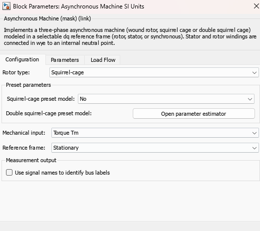
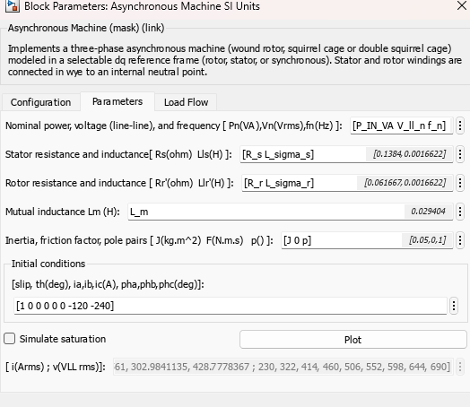
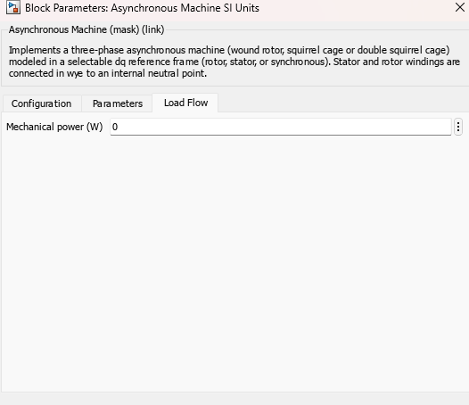

### Inverter Model — *Universal Bridge*
The three-phase inverter is simulated using the **Universal Bridge** block (Specialized Power Systems library), configured as:

- **Number of bridge arms:** `3` (three-leg bridge)  
- **Power electronic device:** IGBT / Diodes  
- **Snubber:** `Rs = 1e5 Ω`, `Cs = inf`  
- **On-state resistance:** `Ron = 1e-3 Ω`  
- **Forward voltages:** `[Device Vf, Diode Vfd] = [0, 0]`  
- **Measurements:** None

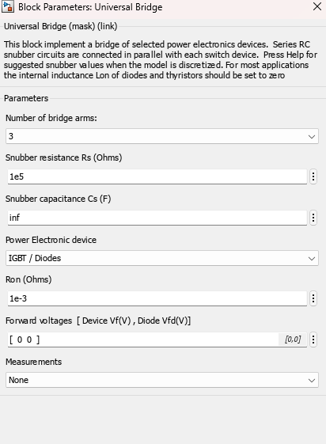

## Controller Subsystem (shared in SIM-only and TARGET)

Both the **SIM-only** model and the **TARGET** model include the same **Controller** subsystem (IFOC), shown in `docs/figures/controller_overview.png`.

The Controller:
- takes as inputs:
  - `i_s_1`, `i_s_2` → measured stator currents (phase 1 and phase 2)
  - `w_r_rif` → rotor speed reference
  - `w_r` → measured rotor speed
- estimates the internal quantities required by **Indirect Field Oriented Control (IFOC)**
- controls the induction motor by generating the inverter **duty cycle** `d`

In addition to `d`, the subsystem exposes several monitoring signals (e.g., current errors, speed/flux errors, estimated rotor flux angle, etc.) useful for debugging and validation.

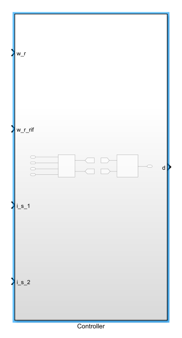

---

### Internal Architecture

The **Controller** is composed of two main blocks:
1. **Control Loop** → implements IFOC control and generates the voltage reference phasor `V_ref` and the estimated rotor flux angle `rho`
2. **PWM** → implements the PWM modulation and converts `V_ref` (with `rho`) into duty cycles `d`

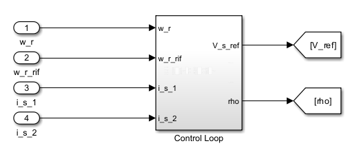  
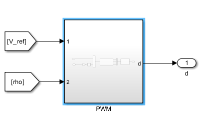

---

## Control Loop Details

The **Control Loop** block:
- processes `i_s_1`, `i_s_2`, `w_r_rif`, and `w_r`
- estimates/control variables for IFOC
- outputs:
  - `V_ref` → stator voltage reference (space vector / phasor) to the PWM block
  - `rho` → estimated rotor flux angle passed to the PWM block
  - optional diagnostics (e.g., `err_phi`, `err_omega`, current errors)

### Blocks inside the Control Loop

#### 1) Measurement
Inputs:
- `i_s_1`, `i_s_2`
- `rho` (rotor flux angle)
- `i_s_q_ref` (q-axis stator current reference)
- `i_m_r_ref` (magnetizing current reference)
- `w_r` (measured rotor speed)

Outputs:
- `i_s_d` → measured d-axis stator current
- `i_s_q` → measured q-axis stator current
- `i_m_r` → estimated/actual magnetizing current
- `rho` → updated rotor flux angle estimate

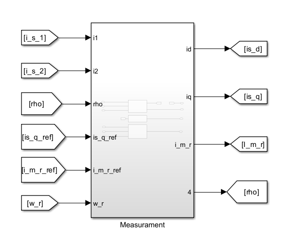

#### 2) Reference Function Block
Input:
- `w_r_rif` (rotor speed reference)

Outputs:
- `i_m_r_ref` → magnetizing current reference
- `w_r_ref` (forwarded/conditioned speed reference)

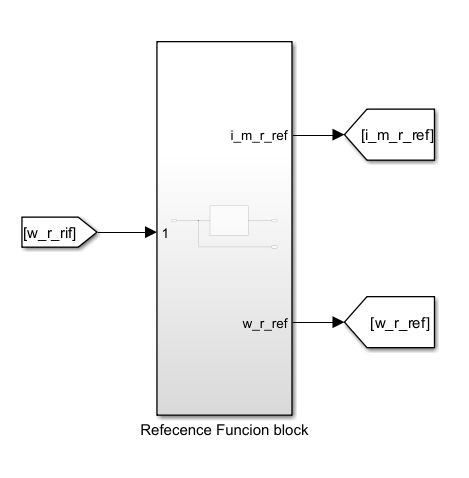

#### 3) Velocity_Flux_Loop
Uses the measured quantities and references to implement the **speed loop** and the **flux (magnetizing) loop**, defining the control law for:
- speed regulation
- rotor flux/magnetization regulation (including field-weakening logic, if enabled)

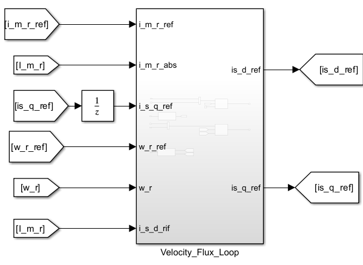

#### 4) Current_Loop
Implements the **decoupled d/q current control** and computes the stator voltage reference:
- output: `V_ref` (to PWM)
- plus current-control error signals (for validation)

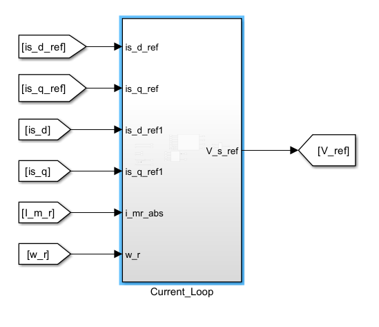

## TI C2000 F28379D Target Constraints (Model Integration)

The control algorithm is prepared for transfer to a **target Simulink model** for the **TI F28379D** with the following constraints.

### PWM Mapping (VSI Legs)
- **PWM1** → inverter leg 1  
- **PWM2** → inverter leg 2  
- **PWM3** → inverter leg 3  

### ADC Mapping (Measurements + Scaling)
- **ADCINA2:** phase-1 current (0 → -100 A, 4095 → 100 A)
- **ADCINB2:** phase-2 current (0 → -100 A, 4095 → 100 A)
- **ADCINC2:** speed (0 → -6000 rpm, 4095 → 6000 rpm)

### Timing / Triggering
- Execute the main control loop inside an **ISR** triggered by **ADC End of Conversion (EOC)**
- Generate ADC **Start of Conversion (SOC)** from **PWM1** at **counter = 0**
- Configure PWM in **up/down mode** to achieve **10 kHz sampling frequency**

### Digital Inputs via SCIA
- The ISR must receive two inputs:
  - **speed reference**
  - **control enable**
- Acquire these inputs via serial communication using **SCIA** in a **100 Hz synchronous task**

---

## Suggested Repository Structure

Recommended layout (rename files to match your project):
